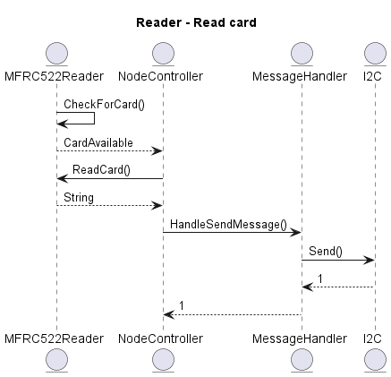
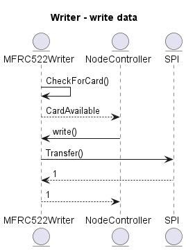

        Reader Schematic:

        Class Diagram Reader:

        Sequence Diagrams Reader:
Sequence diagram Scenario: De Reader leest een tag en stuurt de tag-data naar esp32

        Writer Schematic:

        Class Diagram Writer:

        Sequence Diagrams Writer:
Sequence diagram Scenario: De Writer schrijft data naar een tag
        
