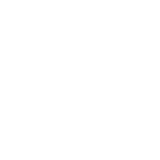
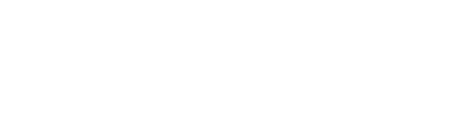

# FindIt

  
   

## Final Product

Uiteindelijk is het net niet gelukt om een werkend product te maken. We zijn erg dichtbij gekomen, maar de uiteindelijke integratie is niet gelukt. Zouden we extra tijd gehad hebben zou dit zeker gewerkt kunnen hebben, maar deze tijd was er helaas niet. De individuele stukken werkten wel. 

Wij bedanken Fontys en Sioux voor hun tijd en hun begeleiding.

## Introductie

Het FindIt-systeem is ontworpen om gebruikers te helpen objecten te vinden in opbergplekken zoals lades, gereedschapswagens of medicijnkasten. Het systeem houdt automatisch bij waar elk object zich bevindt en zorgt ervoor dat de gebruiker gemakkelijk kan vinden wat hij of zij zoekt. Dit wordt bereikt door middel van een centraal systeem waarin de gebruiker kan aangeven wat hij of zij zoekt, waarna het systeem de juiste objecten toont en de gebruiker naar de juiste locatie leidt.

Het FindIt-systeem is modulair opgebouwd, wat betekent dat het gemakkelijk kan worden aangepast aan de specifieke behoeften van de gebruiker, zoals verschillende soorten objecten, opbergplekken en gebruikers.

## Het Team

### [ Nathan](https://github.com/NathanThus)

**Functie / Function:**
Projectleider / Project Leader

**Software Verantwoordelijkheden / Software Responsibilities:**

* Master

<image src="https://upload.wikimedia.org/wikipedia/commons/thumb/c/cd/PlatformIO_logo.svg/2500px-PlatformIO_logo.svg.png" height="28px">

---

### [ Tom](https://github.com/TomVer99)

**Functie / Function:**
Gitbeheerder / Git Master

**Software Verantwoordelijkheden / Software Responsibilities:**

* StyleChecker
* CI (GitHub Actions)
* Server
  * Alle componenten behalve de UI en Message Queue / All components except the UI and Message Queue
  * Componenten integratie / Component integration

---

### [ Coen](https://github.com/coenhezemans)

**Functie / Function:**
Hardware Verantwoordelijke / Hardware Responsible

**Software Verantwoordelijkheden / Software Responsibilities:**

* Node

<image src="https://upload.wikimedia.org/wikipedia/commons/thumb/c/cd/PlatformIO_logo.svg/2500px-PlatformIO_logo.svg.png" height="28px">

---

### [ Yassine](https://github.com/Therealyassinetama)

**Functie / Function:**
Scrum Master

**Software Verantwoordelijkheden / Software Responsibilities:**

* Server
  * UI
  * Message Queue

---

### [ Gharib](https://github.com/GharibGharib)

**Software Verantwoordelijkheden / Software Responsibilities:**

* Node
  * NFC Writer

<image src="https://upload.wikimedia.org/wikipedia/commons/thumb/c/cd/PlatformIO_logo.svg/2500px-PlatformIO_logo.svg.png" height="28px">

---
